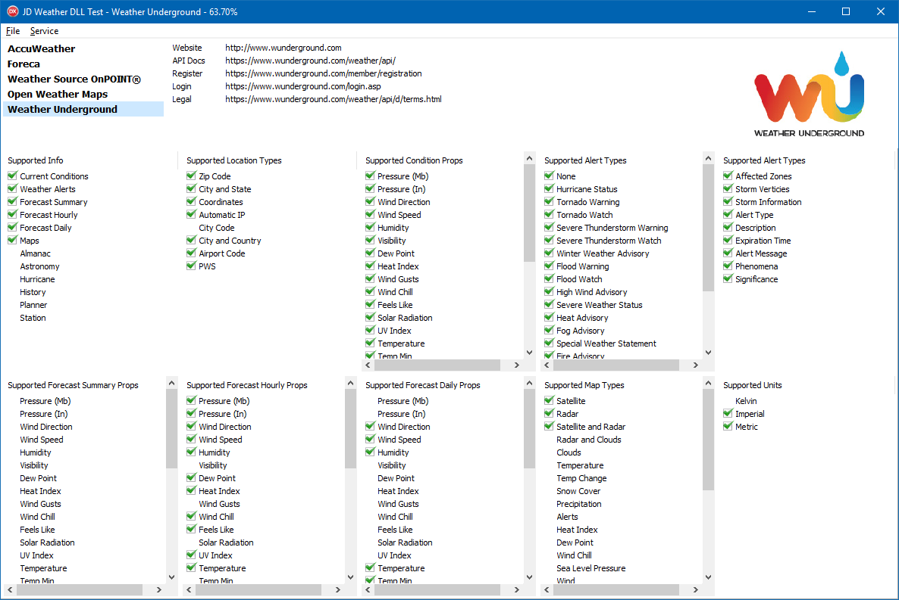

# JD Weather Library

### About

1. Provides the ability for developers to integrate with a choice of many weather services to fetch weather data, including conditions, alerts, forecasts, and maps.
2. Standardizes weather data into a single common structure regardless of which service it came from.
3. Support functions to describe which features are available and which are not in a given service.
4. Lookup weather data by any given number of location information.
5. Each weather service encapsulated in a DLL (Source Included).
6. Add support for new services by writing a new DLL.

### IMPORTANT NOTE

This library is currently in active development, and is not currently functional. It is actually the third complete iteration of this project. 

### Disclaimer

The code and resources in this repository are in no way guaranteed. The author(s) of the library are not responsible for any incorrect, corrupt, damaging, or otherwise undesired results. You take full responsibility to ensure this library suits your requirements. You also take full responsibility to abide by the chosen service(s) guidelines in their corresponding documentation. This includes limited number of requests, limited availability of information, presentation of weather data, and presentation of trademark information and logos. Be sure to thoroughly read the documentation for the chosen service(s) to gain knowledge of these requirements.

### Supported Weather Services

1. [Weather Underground](Readme/WUnderground.md)
2. [AccuWeather](Readme/AccuWeather.md)
3. [OpenWeatherMap](Readme/OpenWeatherMap.md)
4. [Foreca](Readme/Foreca.md)
5. [Weather Source OnPOINT®](Readme/OnPOINT.md)
6. [National Weather Service](Readme/NWS.md)

### How to Create Instance

1. Implement objects for all interfaces found in `JD.Weather.Intf.pas`.
  1. This unit is shared across boundaries, and contains all common types, classes, interfaces, and functions required.
  2. For use of existing supported services, use or convert the unit in your project.
  3. For use of newly supported service, copy or convert the source of one of the existing services.
  4. You can also write a DLL using any programming language, such as C# or C++.
2. Load the library `JDWeather.dll` and get the proc address for `CreateJDWeather`.
  1. There is a procedure type already defined in the interface unit, called `TCreateJDWeather`.
3. Call the function `CreateJDWeather` to obtain a new instance of a `IJDWeather` interface.

**NOTE:** In the future, this will not be necessary, as another component will be written to accommodate for this task.

```delphi
  FLib:= LoadLibrary('JDWeather.dll');
  if FLib <> 0 then begin
    FCreateLib:= GetProcAddress(FLib, 'CreateJDWeather');
    if Assigned(FCreateLib) then begin
      try
        FWeather:= FCreateLib(ExtractFilePath(ParamStr(0)));
        LoadServices;
      except
        on E: Exception do begin
          raise Exception.Create('Failed to create new instance of "IJDWeather": '+E.Message);
        end;
      end;
    end else begin
      raise Exception.Create('Function "CreateJDWeather" not found!');
    end;
  end else begin
    E:= GetLastError;
    raise Exception.Create('Failed to load library "JDWeather.dll" with error code '+IntToStr(E));
  end;
```

### How to Use

1. Choose a service from `IJDWeather.Services`
  1. `Count` returns the number of services
  2. `Items[]` returns a given service by its index
2. Create an account with chosen service and obtain API key
3. Use the `Support` property of a service to see what pieces of information are supported.
4. Wait until I get more stuff implemented and working here...

### Test Application



The test application is not actually utilizing the service APIs themselves, but rather just a proof of concept with dynamically loading multiple DLLs. It shows the following:

1. Supported services, as it finds each DLL.
2. URLs to access the particular service's resources.
3. Logo to represent the selected service.
4. All the properties which are supported for different info types.

### Current State

This project is currently in massive development, and is not yet ready for production use. The whole concept of the project is still up in the air, but slowly becoming established.

The most complete service implemented so far is Weather Underground. Originall, OpenWeatherMap was the first. But the project was started over again in favor for the differences of Weather Underground, and that's when support was added for multiple services. Since then, more services have been added.

There was a nearly complete version of the entire library before this project. However, it was not scalable. Everything was hard-coded in a single unit. This project aims to separate the services, and add support for new services in the future. It also aims to create a new web API which can dynamically integrate with any of the given services - but be converted into the same standard as this library accomplishes with its interfaces.

### Future Plans

In the end, this entire system will be encapsulated inside a single component which can be installed into the Delphi IDE. It provides a multi-threaded environment which in turn automatically fetches weather data on a schedule.

Another major concept (already in the works) is to merge multiple weather data sources into one, averaging out each data point. This helps accomplish the following:

1. More realistic weather data based on averages.
2. Fill in pieces of weather data which are only supported by certain services.

Another project, started but put on the side, is to create a new Web API which allows developers to get weather data in the same standard format as this library's interfaces - but in JSON format. 

